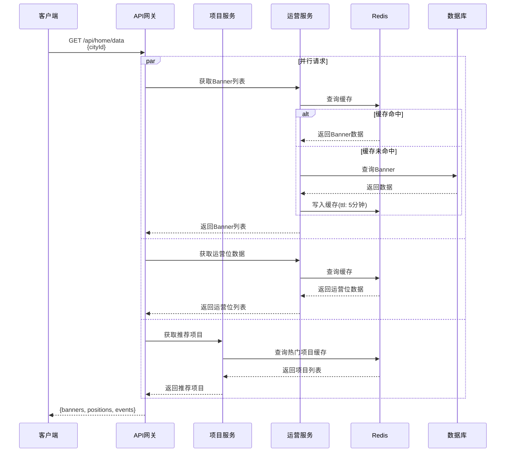

# 演出票务系统业务接口流程图

## 目录

1. [用户注册登录流程](#一用户注册登录流程)
2. [项目浏览和搜索流程](#二项目浏览和搜索流程)
3. [完整购票流程](#三完整购票流程)
4. [支付流程](#四支付流程)
5. [订单管理流程](#五订单管理流程)
6. [退款流程](#六退款流程)
7. [优惠券使用流程](#七优惠券使用流程)
8. [B端项目管理流程](#八b端项目管理流程)
9. [B端订单管理流程](#九b端订单管理流程)
10. [运营后台管理流程](#十运营后台管理流程)

---

## 一、用户注册登录流程

### 1.1 手机号注册流程


### 1.2 手机号登录流程


### 1.3 第三方登录流程（微信）


---

## 二、项目浏览和搜索流程

### 2.1 首页数据加载流程



### 2.2 项目搜索流程


### 2.3 项目详情查询流程


---

## 三、完整购票流程

### 3.1 查询场次票档流程


### 3.2 座位分配流程


### 3.3 创建订单流程


---

## 四、支付流程

### 4.1 发起支付流程


### 4.2 支付回调流程


---

## 五、订单管理流程

### 5.1 订单列表查询流程


### 5.2 订单详情查询流程


### 5.3 订单取消流程


---

## 六、退款流程

### 6.1 申请退款流程


### 6.2 退款审核流程（B端）


---

## 七、优惠券使用流程

### 7.1 领取优惠券流程


### 7.2 查询可用优惠券流程


---

## 八、B端项目管理流程

### 8.1 创建项目流程


### 8.2 添加场次流程


### 8.3 添加票档流程

```mermaid
sequenceDiagram
    participant B as B端商家
    participant GW as API网关
    participant ES as 项目服务
    participant IS as 库存服务
    participant Redis as Redis
    participant DB as 数据库
    
    B->>GW: POST /api/ticket-tiers<br/>{sessionId, name, price, stock}
    GW->>ES: 转发请求
    
    ES->>DB: 插入票档记录
    DB-->>ES: 插入成功
    
    ES->>IS: 初始化库存
    IS->>Redis: 设置库存缓存
    IS->>DB: 更新场次总库存
    
    ES-->>GW: 返回票档信息
    GW-->>B: {ticketTier}
```

---

## 九、B端订单管理流程

### 9.1 订单列表查询流程（B端）

```mermaid
sequenceDiagram
    participant B as B端商家
    participant GW as API网关
    participant OS as 订单服务
    participant DB as 数据库
    
    B->>GW: GET /api/merchant/orders<br/>{status, eventId, page}
    GW->>OS: 转发请求(携带商家ID)
    
    OS->>DB: 查询商家订单列表
    Note over OS,DB: SELECT * FROM t_order<br/>WHERE merchant_id = ?<br/>AND status = ?<br/>ORDER BY create_time DESC
    
    DB-->>OS: 返回订单列表
    OS-->>GW: 返回结果
    GW-->>B: {total, orders}
```

### 9.2 后台售票流程

```mermaid
sequenceDiagram
    participant B as B端商家
    participant GW as API网关
    participant OS as 订单服务
    participant IS as 库存服务
    participant DB as 数据库
    
    B->>GW: POST /api/backend/sell-ticket<br/>{sessionId, items, buyerInfo, paymentMethod}
    GW->>OS: 转发请求
    
    OS->>IS: 锁定库存
    IS-->>OS: 库存已锁定
    
    OS->>DB: 创建订单(标记为后台售票)
    OS->>DB: 直接标记为已支付
    OS->>DB: 生成电子票
    
    OS-->>GW: 返回订单和电子票
    GW-->>B: {order, tickets}
```

### 9.3 发送电子票流程

```mermaid
sequenceDiagram
    participant B as B端商家
    participant GW as API网关
    participant OS as 订单服务
    participant NS as 通知服务
    participant SMS as 短信服务
    participant DB as 数据库
    
    B->>GW: POST /api/orders/{orderId}/send-ticket
    GW->>OS: 转发请求
    
    OS->>DB: 查询订单和电子票
    DB-->>OS: 返回数据
    
    OS->>NS: 发送电子票通知
    NS->>SMS: 发送短信
    SMS-->>NS: 发送成功
    
    NS->>DB: 记录通知日志
    NS-->>OS: 发送完成
    
    OS-->>GW: 发送成功
    GW-->>B: {code: 1000, message: "发送成功"}
```

---

## 十、运营后台管理流程

### 10.1 创建优惠券流程

```mermaid
sequenceDiagram
    participant O as 运营人员
    participant GW as API网关
    participant MS as 营销服务
    participant DB as 数据库
    
    O->>GW: POST /api/admin/coupons<br/>{优惠券信息}
    GW->>MS: 转发请求
    
    MS->>MS: 生成优惠券编码
    MS->>DB: 插入优惠券记录
    DB-->>MS: 插入成功
    
    MS-->>GW: 返回优惠券信息
    GW-->>O: {coupon}
```

### 10.2 批量发放优惠券流程

```mermaid
sequenceDiagram
    participant O as 运营人员
    participant GW as API网关
    participant MS as 营销服务
    participant MQ as 消息队列
    participant DB as 数据库
    
    O->>GW: POST /api/admin/coupons/{couponId}/batch-send<br/>{userIds}
    GW->>MS: 转发请求
    
    MS->>MQ: 发送批量发放消息
    MS-->>GW: 任务已提交
    GW-->>O: {code: 1000, message: "发放任务已提交"}
    
    Note over MQ,DB: 异步处理
    MQ->>MS: 消费消息
    loop 每个用户
        MS->>DB: 创建用户优惠券记录
    end
    MS->>DB: 更新优惠券已领取数量
```

### 10.3 配置Banner流程

```mermaid
sequenceDiagram
    participant O as 运营人员
    participant GW as API网关
    participant OS as 运营服务
    participant OSS as 对象存储
    participant Redis as Redis
    participant DB as 数据库
    
    O->>GW: POST /api/admin/banners<br/>{name, image, linkType, linkValue}
    GW->>OS: 转发请求
    
    OS->>OSS: 上传Banner图片
    OSS-->>OS: 返回图片URL
    
    OS->>DB: 插入Banner记录
    DB-->>OS: 插入成功
    
    OS->>Redis: 清除Banner缓存
    OS-->>GW: 返回Banner信息
    GW-->>O: {banner}
```

### 10.4 用户管理流程

```mermaid
sequenceDiagram
    participant O as 运营人员
    participant GW as API网关
    participant US as 用户服务
    participant Redis as Redis
    participant DB as 数据库
    
    O->>GW: PUT /api/admin/users/{userId}/freeze
    GW->>US: 转发请求
    
    US->>DB: 更新用户状态为frozen
    DB-->>US: 更新成功
    
    US->>Redis: 删除用户Token
    US-->>GW: 冻结成功
    GW-->>O: {code: 1000, message: "用户已冻结"}
```

### 10.5 商家审核流程

```mermaid
sequenceDiagram
    participant O as 运营人员
    participant GW as API网关
    participant MS as 商家服务
    participant NS as 通知服务
    participant DB as 数据库
    
    O->>GW: PUT /api/admin/merchants/{merchantId}/audit<br/>{status: "approved", opinion}
    GW->>MS: 转发请求
    
    MS->>DB: 更新商家状态
    MS->>DB: 记录审核信息
    DB-->>MS: 更新成功
    
    MS->>NS: 发送审核结果通知
    NS-->>MS: 通知已发送
    
    MS-->>GW: 审核完成
    GW-->>O: {code: 1000, message: "审核完成"}
```

---

## 十一、总代票务系统流程

### 11.1 座位图绘制保存流程

```mermaid
sequenceDiagram
    participant A as 总代人员
    participant GW as API网关
    participant ES as 项目服务
    participant DB as 数据库
    
    A->>GW: POST /api/agent/seat-maps<br/>{venueId, name, configData}
    GW->>ES: 转发请求
    
    ES->>ES: 验证座位图配置
    ES->>DB: 插入座位图记录
    DB-->>ES: 插入成功
    
    ES-->>GW: 返回座位图信息
    GW-->>A: {seatMap}
```

### 11.2 配票流程

```mermaid
sequenceDiagram
    participant A as 总代人员
    participant GW as API网关
    participant IS as 库存服务
    participant DB as 数据库
    
    A->>GW: POST /api/agent/allocate-tickets<br/>{sessionId, ticketTierId, channel, quantity}
    GW->>IS: 转发请求
    
    IS->>DB: 查询票档库存
    alt 库存不足
        IS-->>GW: {code: 5001, message: "库存不足"}
        GW-->>A: 返回错误
    end
    
    IS->>DB: 创建配票记录
    IS->>DB: 更新渠道库存
    IS->>DB: 记录操作日志
    
    IS-->>GW: 配票成功
    GW-->>A: {allocation}
```

### 11.3 打票流程

```mermaid
sequenceDiagram
    participant A as 总代人员
    participant GW as API网关
    participant OS as 订单服务
    participant DB as 数据库
    
    A->>GW: POST /api/agent/print-tickets<br/>{orderIds, templateId}
    GW->>OS: 转发请求
    
    loop 每个订单
        OS->>DB: 查询订单和电子票
        OS->>OS: 生成打印数据
        OS->>DB: 更新票状态为已打印
    end
    
    OS-->>GW: 返回打印数据
    GW-->>A: {printData}
    
    Note over A: 调用打印机打印
```

---

## 接口规范说明

### 1. 统一响应格式

```json
{
  "code": 1000,
  "message": "操作成功",
  "data": {},
  "timestamp": 1700000000000
}
```

### 2. 错误码规范

- 1xxx: 通用错误
- 2xxx: 用户相关错误
- 3xxx: 项目相关错误
- 4xxx: 订单相关错误
- 5xxx: 库存相关错误
- 6xxx: 支付相关错误

### 3. 认证方式

所有需要认证的接口在Header中携带：
```
Authorization: Bearer {JWT_TOKEN}
```

### 4. 分页参数

```json
{
  "page": 1,
  "size": 20,
  "sort": "createTime",
  "order": "desc"
}
```

### 5. 分页响应

```json
{
  "total": 100,
  "page": 1,
  "size": 20,
  "data": []
}
```

---

**文档版本**: v1.0  
**更新日期**: 2025-11-17  
**编制人**: Kiro AI Assistant
