# 演出票务系统架构图

## 一、总体架构图

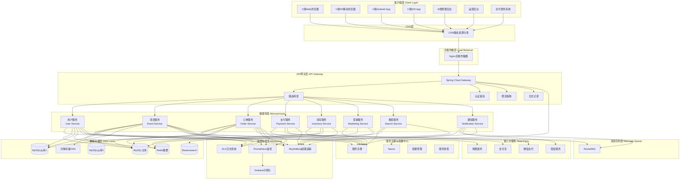

---

## 二、微服务详细架构图

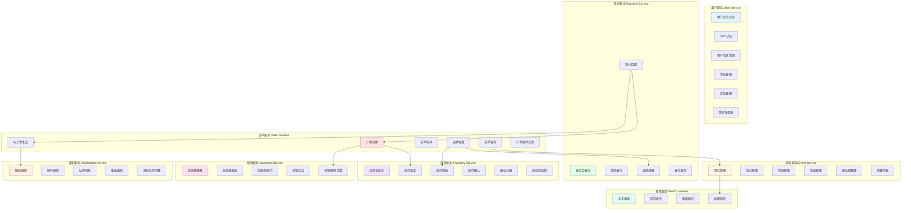

---

## 三、数据流架构图

### 3.1 用户购票流程数据流

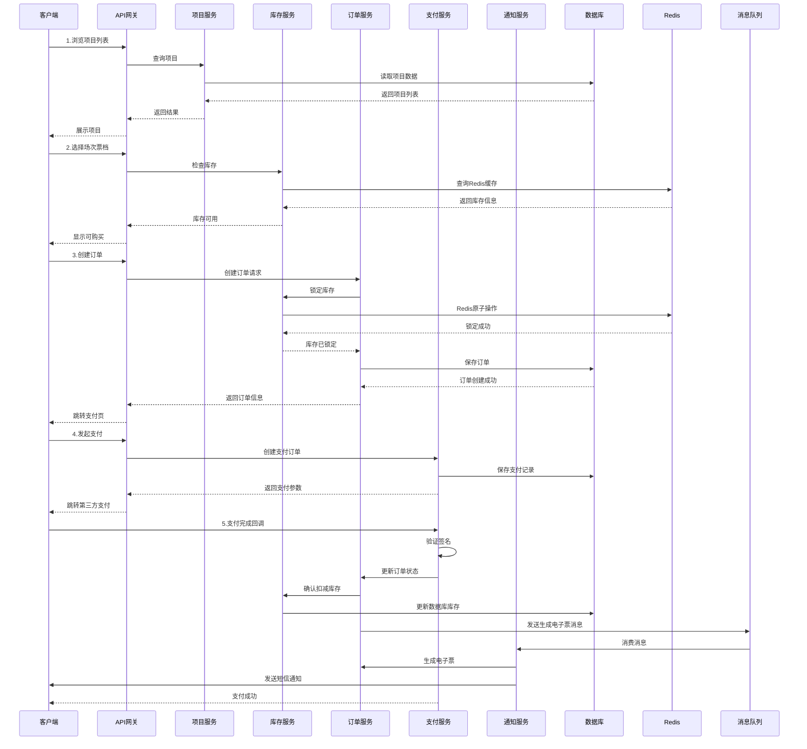

### 3.2 高并发抢票场景数据流

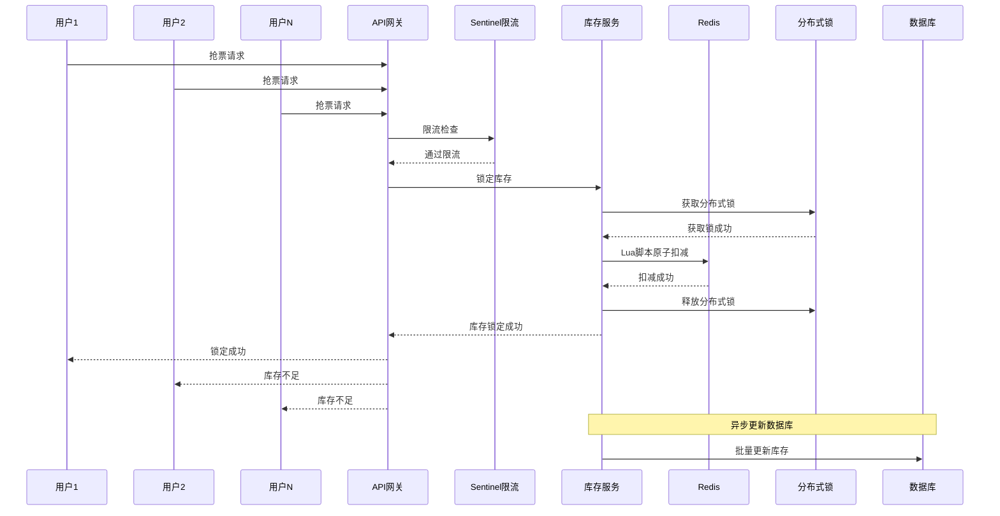

---

## 四、部署架构图

```mermaid
graph TB
    subgraph "Kubernetes集群"
        subgraph "Namespace: gateway"
            GW1[Gateway Pod 1]
            GW2[Gateway Pod 2]
            GW3[Gateway Pod 3]
        end
        
        subgraph "Namespace: services"
            US1[User Service Pod 1]
            US2[User Service Pod 2]
            ES1[Event Service Pod 1]
            ES2[Event Service Pod 2]
            OS1[Order Service Pod 1]
            OS2[Order Service Pod 2]
            OS3[Order Service Pod 3]
            PS1[Payment Service Pod 1]
            IS1[Inventory Service Pod 1]
            IS2[Inventory Service Pod 2]
            MS1[Marketing Service Pod 1]
            SS1[Search Service Pod 1]
            NS1[Notification Service Pod 1]
        end
        
        subgraph "Namespace: middleware"
            NACOS1[Nacos Pod 1]
            NACOS2[Nacos Pod 2]
            NACOS3[Nacos Pod 3]
        end
        
        subgraph "Service"
            SVC1[Gateway Service]
            SVC2[User Service]
            SVC3[Event Service]
            SVC4[Order Service]
            SVC5[Nacos Service]
        end
        
        subgraph "Ingress"
            ING[Nginx Ingress Controller]
        end
    end
    
    subgraph "外部存储"
        MYSQL[MySQL集群]
        REDIS_C[Redis集群]
        ES_C[Elasticsearch集群]
        MQ_C[RocketMQ集群]
        OSS_C[对象存储]
    end
    
    subgraph "监控系统"
        PROM_S[Prometheus]
        GRAF_S[Grafana]
        SKY_S[SkyWalking]
        ELK_S[ELK Stack]
    end
    
    ING --> SVC1
    SVC1 --> GW1
    SVC1 --> GW2
    SVC1 --> GW3
    
    GW1 --> SVC2
    GW1 --> SVC3
    GW1 --> SVC4
    
    SVC2 --> US1
    SVC2 --> US2
    SVC3 --> ES1
    SVC3 --> ES2
    SVC4 --> OS1
    SVC4 --> OS2
    SVC4 --> OS3
    
    US1 --> SVC5
    ES1 --> SVC5
    OS1 --> SVC5
    
    SVC5 --> NACOS1
    SVC5 --> NACOS2
    SVC5 --> NACOS3
    
    US1 --> MYSQL
    ES1 --> MYSQL
    OS1 --> MYSQL
    
    US1 --> REDIS_C
    OS1 --> REDIS_C
    IS1 --> REDIS_C
    
    SS1 --> ES_C
    OS1 --> MQ_C
    NS1 --> MQ_C
    ES1 --> OSS_C
    
    US1 --> PROM_S
    ES1 --> PROM_S
    OS1 --> PROM_S
    
    PROM_S --> GRAF_S
    
    US1 --> SKY_S
    ES1 --> SKY_S
    OS1 --> SKY_S
    
    US1 --> ELK_S
    ES1 --> ELK_S
    OS1 --> ELK_S
```

---

## 五、网络架构图

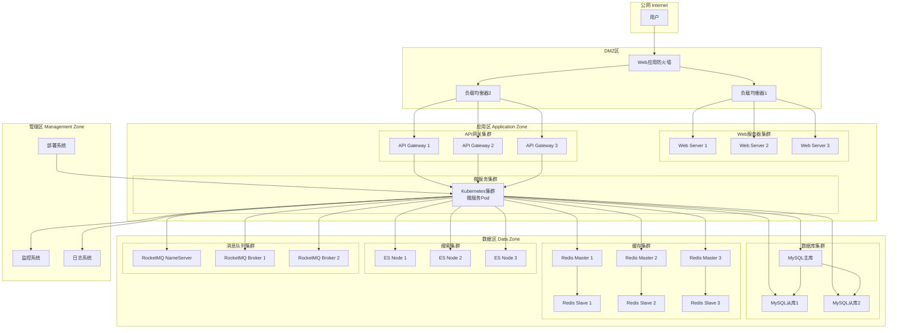

---

## 六、安全架构图

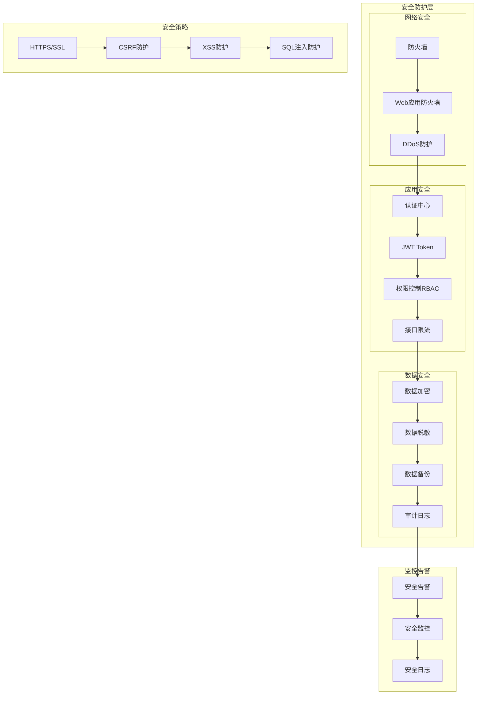

---

## 七、缓存架构图

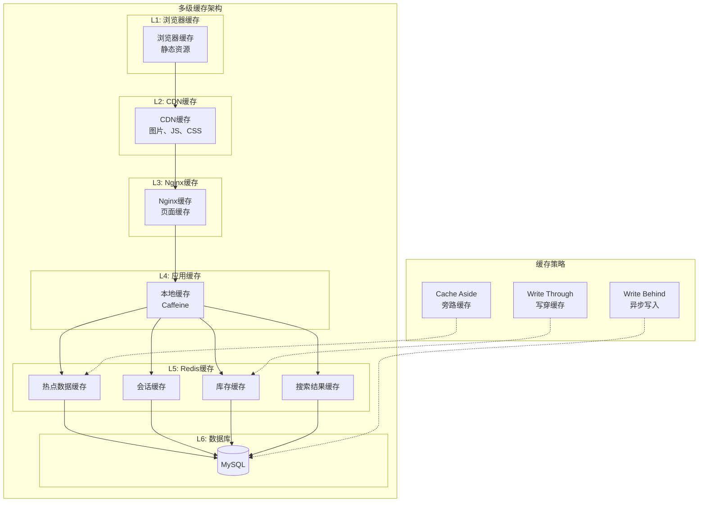

---

## 八、监控架构图

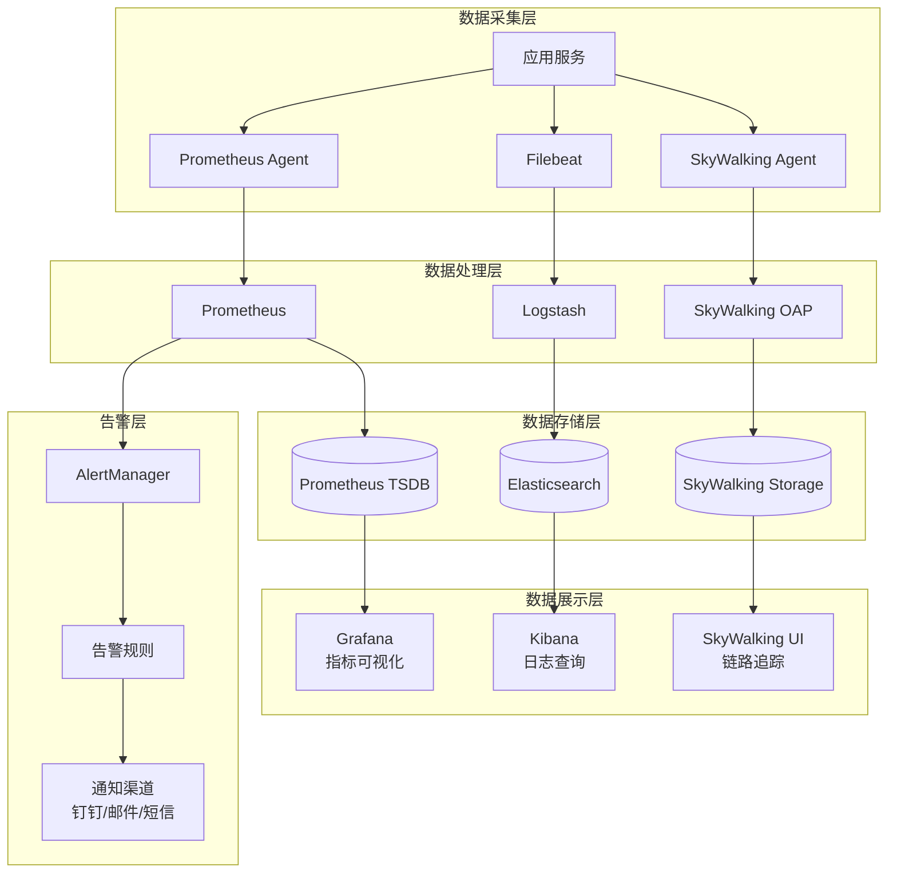

---

## 九、CI/CD流程架构图

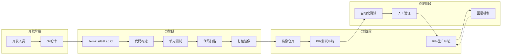

---

## 十、容灾架构图

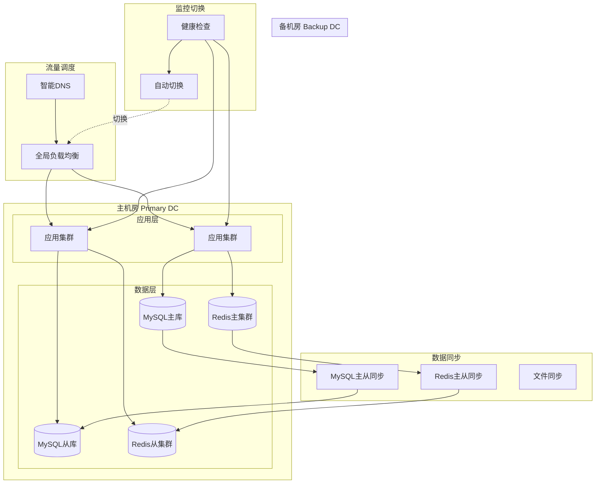

---

## 架构设计说明

### 1. 架构特点

- **高可用**: 多副本部署、主从架构、自动故障转移
- **高性能**: 多级缓存、读写分离、异步处理
- **高并发**: 分布式锁、限流熔断、消息队列削峰
- **可扩展**: 微服务架构、水平扩展、弹性伸缩
- **安全性**: 多层防护、数据加密、权限控制
- **可观测**: 全链路监控、日志追踪、性能分析

### 2. 技术选型理由

- **Spring Cloud Alibaba**: 成熟的微服务生态，适合国内环境
- **Nacos**: 服务注册与配置管理一体化
- **MySQL**: 成熟稳定的关系型数据库
- **Redis**: 高性能缓存，支持多种数据结构
- **RocketMQ**: 高可靠消息队列，支持事务消息
- **Elasticsearch**: 强大的全文搜索引擎
- **Kubernetes**: 容器编排，自动化部署和扩展

### 3. 性能指标

- **QPS**: 单服务支持1000+ QPS
- **响应时间**: P99 < 500ms
- **可用性**: 99.9%
- **并发用户**: 支持10万+在线用户
- **数据一致性**: 最终一致性

---

**文档版本**: v1.0  
**更新日期**: 2025-11-17  
**编制人**: Kiro AI Assistant
