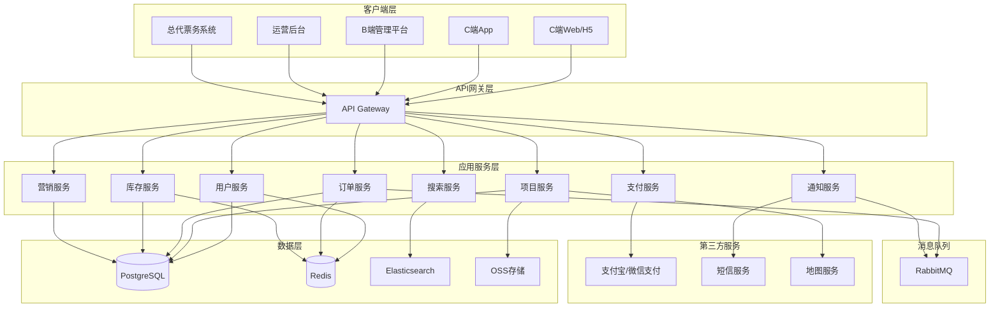
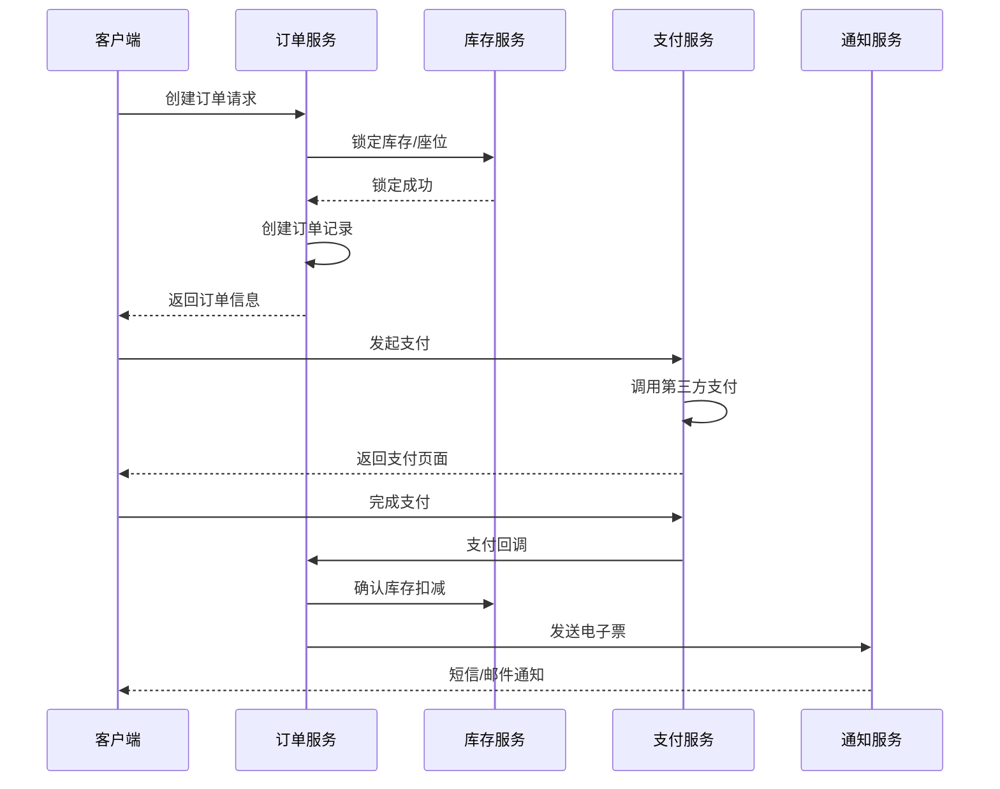
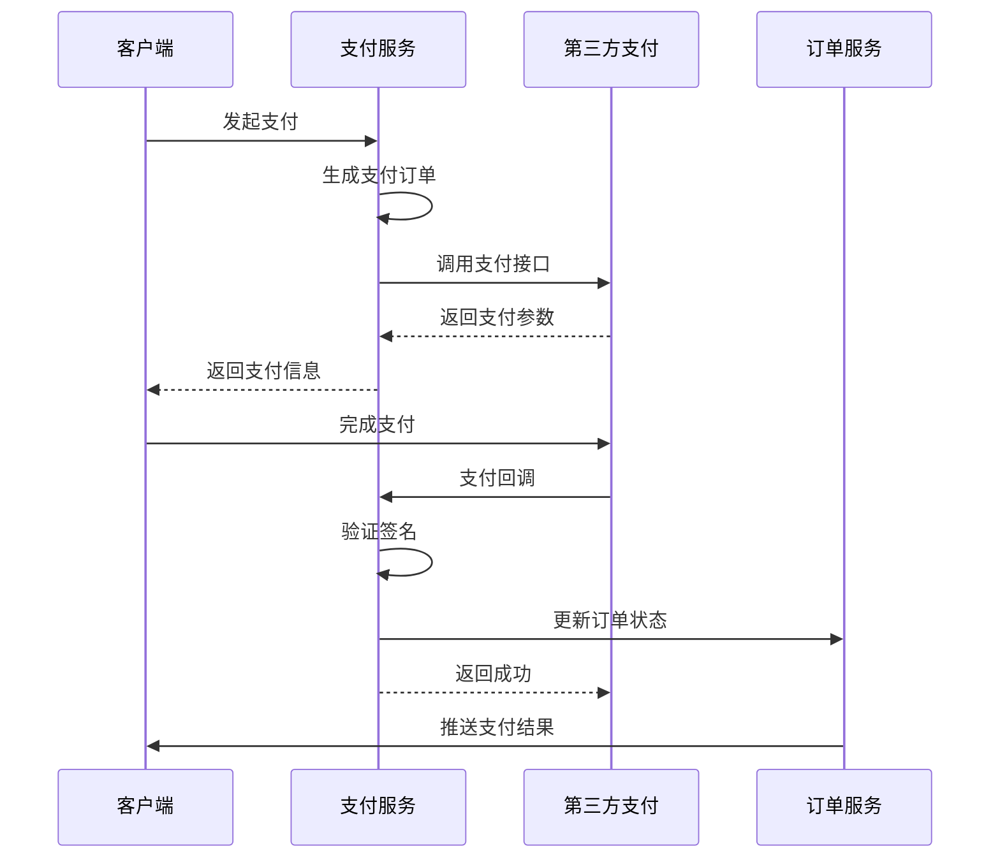
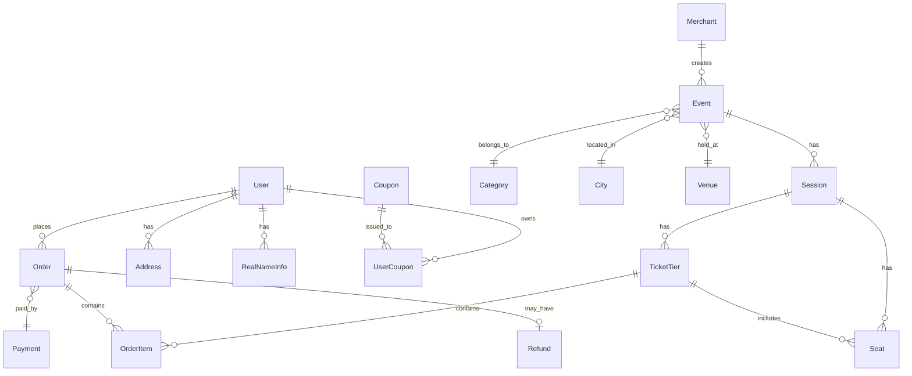
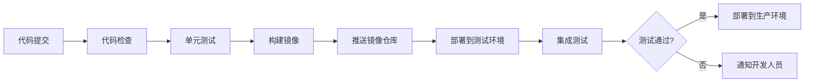

# 演出票务系统设计文档

## 概述

本文档描述演出票务系统的技术架构和设计方案。系统采用微服务架构，前后端分离，支持高并发场景下的票务交易。整体架构包括C端应用（Web/H5/App）、B端管理平台、运营后台、总代票务系统，以及支撑这些应用的后端服务集群。

## 技术栈

### 前端技术栈
- **C端 Web/H5/App (推荐方案)**: uni-app框架
  - **核心技术**: Vue 3 + TypeScript + uni-app
  - **UI组件库**: uni-ui (官方组件库)
  - **一套代码多端运行**: 
    - H5 (浏览器访问)
    - 微信小程序
    - Android App
    - iOS App
    - PC Web (通过响应式适配)
  - **优势**:
    - 真正的一套代码多端发布
    - 原生性能，接近原生App体验
    - 丰富的插件生态
    - 完善的文档和社区支持
    - 支持原生API调用
- **B端/运营后台/总代**: Vue 3 + TypeScript + Element Plus + Vite
- **状态管理**: Pinia
- **数据请求**: uni.request (uni-app封装) / Axios
- **路由**: uni-app内置路由

### 后端技术栈
- **开发框架**: Spring Boot 3.x + Spring Cloud Alibaba
- **微服务框架**: 
  - Spring Cloud Gateway (API网关)
  - Nacos (服务注册与配置中心)
  - Sentinel (流量控制、熔断降级)
  - Seata (分布式事务)
- **ORM框架**: MyBatis-Plus
- **数据库**: MySQL 8.0 (主数据库) + Redis 7.x (缓存/会话/分布式锁)
- **搜索引擎**: Elasticsearch 8.x (项目搜索)
- **消息队列**: RocketMQ (异步任务处理)
- **文件存储**: 阿里云OSS / MinIO
- **支付**: 支付宝SDK + 微信支付SDK
- **短信**: 阿里云短信服务
- **安全认证**: Spring Security + JWT
- **API文档**: Knife4j (Swagger增强版)

### 基础设施
- **容器化**: Docker + Kubernetes
- **API网关**: Spring Cloud Gateway
- **服务注册**: Nacos
- **配置中心**: Nacos Config
- **监控**: Prometheus + Grafana + Spring Boot Actuator
- **日志**: ELK Stack (Elasticsearch + Logstash + Kibana)
- **链路追踪**: SkyWalking

## 系统架构


### 整体架构图



### 微服务划分

系统按业务领域划分为以下核心微服务：

1. **用户服务 (User Service)**: 处理用户注册、登录、个人信息管理、实名认证
2. **项目服务 (Event Service)**: 管理演出项目、场次、票档、座位图
3. **订单服务 (Order Service)**: 处理订单创建、支付、退款、订单查询
4. **支付服务 (Payment Service)**: 集成第三方支付，处理支付回调
5. **库存服务 (Inventory Service)**: 管理票档库存、座位分配、库存锁定
6. **营销服务 (Marketing Service)**: 管理优惠券、促销活动、用户权益
7. **搜索服务 (Search Service)**: 提供项目搜索、筛选功能
8. **通知服务 (Notification Service)**: 发送短信、邮件、站内消息

## 核心模块设计

### 1. 用户模块

#### 后端项目结构

```
ticketing-system/
├── ticketing-gateway/          # API网关服务
├── ticketing-common/            # 公共模块
│   ├── common-core/            # 核心工具类
│   ├── common-redis/           # Redis配置
│   ├── common-security/        # 安全认证
│   └── common-swagger/         # API文档
├── ticketing-user/             # 用户服务
│   ├── user-api/               # 接口定义
│   └── user-service/           # 服务实现
├── ticketing-event/            # 项目服务
│   ├── event-api/
│   └── event-service/
├── ticketing-order/            # 订单服务
│   ├── order-api/
│   └── order-service/
├── ticketing-payment/          # 支付服务
│   ├── payment-api/
│   └── payment-service/
├── ticketing-inventory/        # 库存服务
│   ├── inventory-api/
│   └── inventory-service/
├── ticketing-marketing/        # 营销服务
│   ├── marketing-api/
│   └── marketing-service/
├── ticketing-search/           # 搜索服务
│   └── search-service/
└── ticketing-notification/     # 通知服务
    └── notification-service/
```

#### 数据模型

```java
// 用户实体
@Data
@TableName("t_user")
public class User {
    @TableId(type = IdType.ASSIGN_ID)
    private Long id;
    
    @TableField("phone")
    private String phone;
    
    @TableField("password")
    private String password; // 加密存储
    
    @TableField("nickname")
    private String nickname;
    
    @TableField("avatar")
    private String avatar;
    
    @TableField("city_id")
    private Long cityId;
    
    @TableField("status")
    private String status; // active, frozen
    
    @TableField(fill = FieldFill.INSERT)
    private LocalDateTime createdAt;
    
    @TableField(fill = FieldFill.INSERT_UPDATE)
    private LocalDateTime updatedAt;
}

// 实名信息实体
@Data
@TableName("t_real_name_info")
public class RealNameInfo {
    @TableId(type = IdType.ASSIGN_ID)
    private Long id;
    
    @TableField("user_id")
    private Long userId;
    
    @TableField("real_name")
    private String realName;
    
    @TableField("id_card")
    private String idCard; // 加密存储
    
    @TableField("is_default")
    private Boolean isDefault;
    
    @TableField(fill = FieldFill.INSERT)
    private LocalDateTime createdAt;
}

// 收货地址实体
@Data
@TableName("t_address")
public class Address {
    @TableId(type = IdType.ASSIGN_ID)
    private Long id;
    
    @TableField("user_id")
    private Long userId;
    
    @TableField("receiver_name")
    private String receiverName;
    
    @TableField("receiver_phone")
    private String receiverPhone;
    
    @TableField("province")
    private String province;
    
    @TableField("city")
    private String city;
    
    @TableField("district")
    private String district;
    
    @TableField("detail_address")
    private String detailAddress;
    
    @TableField("is_default")
    private Boolean isDefault;
    
    @TableField(fill = FieldFill.INSERT)
    private LocalDateTime createdAt;
}
```

#### 核心接口


- `POST /api/user/register` - 用户注册
- `POST /api/user/login` - 用户登录
- `POST /api/user/send-sms` - 发送验证码
- `GET /api/user/profile` - 获取用户信息
- `PUT /api/user/profile` - 更新用户信息
- `GET /api/user/addresses` - 获取收货地址列表
- `POST /api/user/addresses` - 添加收货地址
- `GET /api/user/real-names` - 获取实名信息列表
- `POST /api/user/real-names` - 添加实名信息

#### 认证机制

- 使用JWT Token进行身份认证
- Token存储在Redis中，支持主动失效
- 刷新Token机制，Access Token有效期2小时，Refresh Token有效期7天
- 敏感信息（密码、身份证号）使用AES-256加密存储

### 2. 项目模块

#### 数据模型

```java
// 项目实体
@Data
@TableName("t_event")
public class Event {
    @TableId(type = IdType.ASSIGN_ID)
    private Long id;
    
    @TableField("merchant_id")
    private Long merchantId;
    
    @TableField("name")
    private String name;
    
    @TableField("category_id")
    private Long categoryId;
    
    @TableField("city_id")
    private Long cityId;
    
    @TableField("venue_id")
    private Long venueId;
    
    @TableField("cover_image")
    private String coverImage;
    
    @TableField("images")
    private String images; // JSON数组字符串
    
    @TableField("description")
    private String description;
    
    @TableField("notice")
    private String notice;
    
    @TableField("duration")
    private Integer duration; // 分钟
    
    @TableField("min_price")
    private BigDecimal minPrice;
    
    @TableField("max_price")
    private BigDecimal maxPrice;
    
    @TableField("status")
    private String status; // draft, on_sale, sold_out, ended, cancelled
    
    @TableField("tags")
    private String tags; // JSON数组字符串
    
    @TableField(fill = FieldFill.INSERT)
    private LocalDateTime createdAt;
    
    @TableField(fill = FieldFill.INSERT_UPDATE)
    private LocalDateTime updatedAt;
}

// 场次实体
@Data
@TableName("t_session")
public class Session {
    @TableId(type = IdType.ASSIGN_ID)
    private Long id;
    
    @TableField("event_id")
    private Long eventId;
    
    @TableField("start_time")
    private LocalDateTime startTime;
    
    @TableField("end_time")
    private LocalDateTime endTime;
    
    @TableField("status")
    private String status; // on_sale, sold_out, ended, cancelled
    
    @TableField(fill = FieldFill.INSERT)
    private LocalDateTime createdAt;
}

// 票档实体
@Data
@TableName("t_ticket_tier")
public class TicketTier {
    @TableId(type = IdType.ASSIGN_ID)
    private Long id;
    
    @TableField("session_id")
    private Long sessionId;
    
    @TableField("name")
    private String name;
    
    @TableField("price")
    private BigDecimal price;
    
    @TableField("total_stock")
    private Integer totalStock;
    
    @TableField("available_stock")
    private Integer availableStock;
    
    @TableField("seat_area")
    private String seatArea;
    
    @TableField("status")
    private String status; // on_sale, sold_out
    
    @TableField(fill = FieldFill.INSERT)
    private LocalDateTime createdAt;
}

// 座位实体
@Data
@TableName("t_seat")
public class Seat {
    @TableId(type = IdType.ASSIGN_ID)
    private Long id;
    
    @TableField("session_id")
    private Long sessionId;
    
    @TableField("ticket_tier_id")
    private Long ticketTierId;
    
    @TableField("seat_map_id")
    private Long seatMapId;
    
    @TableField("row")
    private String row;
    
    @TableField("number")
    private String number;
    
    @TableField("status")
    private String status; // available, locked, sold
    
    @TableField("locked_until")
    private LocalDateTime lockedUntil;
    
    @TableField(fill = FieldFill.INSERT)
    private LocalDateTime createdAt;
}

// 场馆实体
@Data
@TableName("t_venue")
public class Venue {
    @TableId(type = IdType.ASSIGN_ID)
    private Long id;
    
    @TableField("name")
    private String name;
    
    @TableField("city_id")
    private Long cityId;
    
    @TableField("address")
    private String address;
    
    @TableField("latitude")
    private BigDecimal latitude;
    
    @TableField("longitude")
    private BigDecimal longitude;
    
    @TableField("capacity")
    private Integer capacity;
    
    @TableField(fill = FieldFill.INSERT)
    private LocalDateTime createdAt;
}

// 座位图实体
@Data
@TableName("t_seat_map")
public class SeatMap {
    @TableId(type = IdType.ASSIGN_ID)
    private Long id;
    
    @TableField("venue_id")
    private Long venueId;
    
    @TableField("name")
    private String name;
    
    @TableField("config")
    private String config; // JSON配置，存储座位布局
    
    @TableField(fill = FieldFill.INSERT)
    private LocalDateTime createdAt;
}
```

#### 核心接口

- `GET /api/events` - 获取项目列表（支持筛选、分页）
- `GET /api/events/:id` - 获取项目详情
- `GET /api/events/:id/sessions` - 获取项目场次列表
- `GET /api/sessions/:id/ticket-tiers` - 获取场次票档列表
- `POST /api/events` - 创建项目（B端）
- `PUT /api/events/:id` - 更新项目（B端）
- `POST /api/sessions` - 创建场次（B端）
- `POST /api/ticket-tiers` - 创建票档（B端）
- `GET /api/seat-maps/:id` - 获取座位图配置
- `POST /api/seat-maps` - 创建座位图（总代）

### 3. 订单模块

#### 数据模型

```typescript
// 订单表
interface Order {
  id: string;
  orderNo: string;
  userId: string;
  eventId: string;
  sessionId: string;
  totalAmount: number;
  serviceFee: number;
  deliveryFee: number;
  discountAmount: number;
  payableAmount: number;
  status: 'pending' | 'paid' | 'cancelled' | 'refunding' | 'refunded';
  paymentMethod: string;
  deliveryMethod: 'electronic' | 'express';
  addressId?: string;
  createdAt: Date;
  paidAt?: Date;
  cancelledAt?: Date;
}

// 订单项表
interface OrderItem {
  id: string;
  orderId: string;
  ticketTierId: string;
  seatId?: string;
  price: number;
  buyerName: string;
  buyerPhone: string;
  realNameId?: string;
  ticketCode: string; // 电子票码
  status: 'valid' | 'used' | 'refunded';
  createdAt: Date;
}

// 退款表
interface Refund {
  id: string;
  orderId: string;
  orderItemIds: string[];
  refundAmount: number;
  reason: string;
  status: 'pending' | 'approved' | 'rejected' | 'completed';
  createdAt: Date;
  completedAt?: Date;
}
```

#### 核心接口


- `POST /api/orders/create` - 创建订单
- `GET /api/orders/:id` - 获取订单详情
- `GET /api/orders` - 获取订单列表
- `POST /api/orders/:id/pay` - 发起支付
- `POST /api/orders/:id/cancel` - 取消订单
- `POST /api/refunds` - 申请退款
- `PUT /api/refunds/:id` - 处理退款（B端）
- `GET /api/tickets` - 获取电子票列表（票夹）

#### 订单创建流程



### 4. 库存模块

#### 库存管理策略

库存服务是高并发场景的核心，采用以下策略：

1. **分布式锁**: 使用Redis实现分布式锁，防止超卖
2. **库存预扣**: 创建订单时预扣库存，设置15分钟过期时间
3. **座位锁定**: 选座时锁定座位5分钟，超时自动释放
4. **库存缓存**: 热门项目库存缓存到Redis，减少数据库压力
5. **异步更新**: 库存变更通过消息队列异步更新到数据库

#### 核心接口

- `POST /api/inventory/lock` - 锁定库存
- `POST /api/inventory/unlock` - 释放库存
- `POST /api/inventory/confirm` - 确认扣减库存
- `GET /api/inventory/check` - 检查库存可用性
- `POST /api/seats/allocate` - 分配座位
- `POST /api/seats/lock` - 锁定座位
- `POST /api/seats/unlock` - 释放座位

#### 防超卖机制

```typescript
// Redis Lua脚本实现原子性库存扣减
const lockInventoryScript = `
  local key = KEYS[1]
  local quantity = tonumber(ARGV[1])
  local ttl = tonumber(ARGV[2])
  
  local current = tonumber(redis.call('get', key) or 0)
  if current >= quantity then
    redis.call('decrby', key, quantity)
    redis.call('expire', key, ttl)
    return 1
  else
    return 0
  end
`;
```

### 5. 支付模块

#### 支付流程



#### 数据模型

```typescript
// 支付订单表
interface Payment {
  id: string;
  paymentNo: string;
  orderId: string;
  amount: number;
  paymentMethod: 'alipay' | 'wechat' | 'bank_card';
  status: 'pending' | 'success' | 'failed' | 'cancelled';
  thirdPartyNo?: string;
  createdAt: Date;
  paidAt?: Date;
}
```

#### 核心接口

- `POST /api/payment/create` - 创建支付订单
- `POST /api/payment/alipay/callback` - 支付宝回调
- `POST /api/payment/wechat/callback` - 微信支付回调
- `GET /api/payment/:id/status` - 查询支付状态
- `POST /api/payment/:id/refund` - 发起退款

### 6. 营销模块

#### 数据模型

```typescript
// 优惠券表
interface Coupon {
  id: string;
  name: string;
  type: 'discount' | 'cash' | 'gift';
  discountRate?: number; // 折扣率
  discountAmount?: number; // 减免金额
  minAmount: number; // 最低消费金额
  totalQuantity: number;
  receivedQuantity: number;
  validFrom: Date;
  validTo: Date;
  status: 'active' | 'inactive';
  createdAt: Date;
}

// 用户优惠券表
interface UserCoupon {
  id: string;
  userId: string;
  couponId: string;
  status: 'unused' | 'used' | 'expired';
  usedAt?: Date;
  createdAt: Date;
}

// 促销活动表
interface Promotion {
  id: string;
  name: string;
  type: 'full_reduction' | 'discount' | 'bundle';
  rules: object; // JSON配置
  eventIds: string[]; // 适用项目
  validFrom: Date;
  validTo: Date;
  status: 'active' | 'inactive';
  createdAt: Date;
}
```

#### 核心接口

- `GET /api/coupons` - 获取可领取优惠券列表
- `POST /api/coupons/:id/receive` - 领取优惠券
- `GET /api/user/coupons` - 获取用户优惠券列表
- `POST /api/promotions` - 创建促销活动（运营后台）
- `GET /api/promotions/applicable` - 获取适用的促销活动

### 7. 搜索模块

#### Elasticsearch索引设计

```typescript
// 项目索引
interface EventIndex {
  id: string;
  name: string;
  categoryId: string;
  categoryName: string;
  cityId: string;
  cityName: string;
  venueName: string;
  minPrice: number;
  maxPrice: number;
  startTime: Date;
  tags: string[];
  status: string;
  salesVolume: number; // 销量
  createdAt: Date;
}
```

#### 搜索功能

- 全文搜索：支持项目名称、艺人、场馆搜索
- 多维度筛选：城市、类目、价格区间、时间范围
- 排序：按时间、价格、热度、销量排序
- 搜索建议：输入时提供自动补全建议

#### 核心接口

- `GET /api/search/events` - 搜索项目
- `GET /api/search/suggest` - 搜索建议

### 8. 通知模块

#### 通知类型


1. **短信通知**: 验证码、订单确认、电子票发送、退款通知
2. **邮件通知**: 电子票、订单详情、营销活动
3. **站内消息**: 系统通知、活动推送
4. **推送通知**: App推送

#### 数据模型

```typescript
// 通知记录表
interface Notification {
  id: string;
  userId: string;
  type: 'sms' | 'email' | 'push' | 'system';
  title: string;
  content: string;
  status: 'pending' | 'sent' | 'failed';
  sentAt?: Date;
  createdAt: Date;
}
```

#### 核心接口

- `POST /api/notifications/send` - 发送通知
- `GET /api/notifications` - 获取用户通知列表
- `PUT /api/notifications/:id/read` - 标记已读

## 前端架构设计

### C端应用架构 (uni-app)

#### 目录结构

```
c-client-uniapp/
├── pages/                  # 页面目录
│   ├── index/              # 首页
│   │   └── index.vue
│   ├── events/             # 项目列表
│   │   └── list.vue
│   ├── event-detail/       # 项目详情
│   │   └── detail.vue
│   ├── ticket-select/      # 选票
│   │   └── index.vue
│   ├── seat-select/        # 选座
│   │   └── index.vue
│   ├── order-confirm/      # 订单确认
│   │   └── index.vue
│   ├── order-result/       # 订单完成
│   │   └── index.vue
│   ├── my/                 # 个人中心
│   │   ├── index.vue
│   │   ├── orders.vue
│   │   ├── order-detail.vue
│   │   └── tickets.vue
│   └── auth/               # 登录注册
│       ├── login.vue
│       └── register.vue
├── components/             # 组件目录
│   ├── common/             # 公共组件
│   │   ├── nav-bar.vue
│   │   ├── tab-bar.vue
│   │   ├── city-selector.vue
│   │   └── ...
│   ├── event/              # 项目相关组件
│   │   ├── event-card.vue
│   │   ├── event-list.vue
│   │   └── ...
│   └── order/              # 订单相关组件
├── store/                  # Pinia状态管理
│   ├── user.ts
│   ├── cart.ts
│   └── city.ts
├── api/                    # API接口
│   ├── request.ts          # uni.request封装
│   ├── user.ts
│   ├── event.ts
│   └── order.ts
├── utils/                  # 工具函数
│   ├── format.ts
│   ├── validate.ts
│   └── ...
├── static/                 # 静态资源
│   ├── images/
│   └── icons/
├── uni_modules/            # uni-app插件
├── types/                  # TypeScript类型
│   ├── user.ts
│   ├── event.ts
│   └── order.ts
├── App.vue                 # 应用配置
├── main.ts                 # 入口文件
├── manifest.json           # 应用配置
├── pages.json              # 页面路由配置
└── uni.scss                # 全局样式变量
```

#### uni-app多端适配策略

```scss
// uni.scss - 全局样式变量
$uni-color-primary: #FF6B6B;
$uni-color-success: #52C41A;
$uni-color-warning: #FAAD14;
$uni-color-error: #F5222D;

// 响应式适配
// uni-app使用rpx单位自动适配不同屏幕
.container {
  padding: 32rpx;
  
  // 条件编译 - PC端特殊样式
  /* #ifdef H5 */
  @media (min-width: 768px) {
    max-width: 1200px;
    margin: 0 auto;
  }
  /* #endif */
}
```

#### 条件编译示例

```vue
<!-- 不同平台显示不同内容 -->
<template>
  <view class="page">
    <!-- #ifdef H5 -->
    <view class="pc-header">PC端头部</view>
    <!-- #endif -->
    
    <!-- #ifdef APP-PLUS -->
    <view class="app-header">App端头部</view>
    <!-- #endif -->
    
    <!-- #ifdef MP-WEIXIN -->
    <view class="wx-header">微信小程序头部</view>
    <!-- #endif -->
    
    <!-- 所有平台共用内容 -->
    <view class="content">
      内容区域
    </view>
  </view>
</template>

<script setup lang="ts">
// 条件编译 - 不同平台使用不同API
// #ifdef H5
const navigateToMap = () => {
  window.open(`https://map.baidu.com/...`)
}
// #endif

// #ifdef APP-PLUS
const navigateToMap = () => {
  plus.runtime.openURL(`baidumap://...`)
}
// #endif
</script>
```

#### 状态管理

使用Pinia进行状态管理：

```typescript
// stores/user.ts
import { defineStore } from 'pinia'

export const useUserStore = defineStore('user', {
  state: () => ({
    user: null as User | null,
    token: localStorage.getItem('token') || null,
    isLoggedIn: false
  }),
  
  getters: {
    userInfo: (state) => state.user,
    isAuthenticated: (state) => !!state.token
  },
  
  actions: {
    async login(phone: string, password: string) {
      const res = await loginApi(phone, password)
      this.token = res.token
      this.user = res.user
      this.isLoggedIn = true
      localStorage.setItem('token', res.token)
    },
    
    logout() {
      this.token = null
      this.user = null
      this.isLoggedIn = false
      localStorage.removeItem('token')
    },
    
    async updateProfile(data: Partial<User>) {
      const res = await updateProfileApi(data)
      this.user = res
    }
  }
})

// stores/city.ts
export const useCityStore = defineStore('city', {
  state: () => ({
    currentCity: null as City | null,
    cities: [] as City[]
  }),
  
  actions: {
    setCity(city: City) {
      this.currentCity = city
      localStorage.setItem('cityId', city.id)
    },
    
    async fetchCities() {
      const res = await getCitiesApi()
      this.cities = res
    }
  }
})

// stores/cart.ts
export const useCartStore = defineStore('cart', {
  state: () => ({
    items: [] as CartItem[]
  }),
  
  getters: {
    totalCount: (state) => state.items.reduce((sum, item) => sum + item.quantity, 0),
    totalAmount: (state) => state.items.reduce((sum, item) => sum + item.price * item.quantity, 0)
  },
  
  actions: {
    addItem(item: CartItem) {
      this.items.push(item)
    },
    
    removeItem(itemId: string) {
      const index = this.items.findIndex(item => item.id === itemId)
      if (index > -1) {
        this.items.splice(index, 1)
      }
    },
    
    clear() {
      this.items = []
    }
  }
})
```

#### 路由配置 (pages.json)

```json
{
  "pages": [
    {
      "path": "pages/index/index",
      "style": {
        "navigationBarTitleText": "首页",
        "enablePullDownRefresh": true
      }
    },
    {
      "path": "pages/events/list",
      "style": {
        "navigationBarTitleText": "演出列表"
      }
    },
    {
      "path": "pages/event-detail/detail",
      "style": {
        "navigationBarTitleText": "演出详情"
      }
    },
    {
      "path": "pages/ticket-select/index",
      "style": {
        "navigationBarTitleText": "选择票档"
      }
    },
    {
      "path": "pages/seat-select/index",
      "style": {
        "navigationBarTitleText": "选择座位"
      }
    },
    {
      "path": "pages/order-confirm/index",
      "style": {
        "navigationBarTitleText": "确认订单"
      }
    },
    {
      "path": "pages/order-result/index",
      "style": {
        "navigationBarTitleText": "支付结果"
      }
    },
    {
      "path": "pages/my/index",
      "style": {
        "navigationBarTitleText": "我的"
      }
    },
    {
      "path": "pages/my/orders",
      "style": {
        "navigationBarTitleText": "我的订单"
      }
    },
    {
      "path": "pages/my/order-detail",
      "style": {
        "navigationBarTitleText": "订单详情"
      }
    },
    {
      "path": "pages/my/tickets",
      "style": {
        "navigationBarTitleText": "我的票夹"
      }
    },
    {
      "path": "pages/auth/login",
      "style": {
        "navigationBarTitleText": "登录"
      }
    },
    {
      "path": "pages/auth/register",
      "style": {
        "navigationBarTitleText": "注册"
      }
    }
  ],
  "tabBar": {
    "color": "#999999",
    "selectedColor": "#FF6B6B",
    "backgroundColor": "#ffffff",
    "borderStyle": "black",
    "list": [
      {
        "pagePath": "pages/index/index",
        "text": "首页",
        "iconPath": "static/icons/home.png",
        "selectedIconPath": "static/icons/home-active.png"
      },
      {
        "pagePath": "pages/events/list",
        "text": "演出",
        "iconPath": "static/icons/event.png",
        "selectedIconPath": "static/icons/event-active.png"
      },
      {
        "pagePath": "pages/my/index",
        "text": "我的",
        "iconPath": "static/icons/my.png",
        "selectedIconPath": "static/icons/my-active.png"
      }
    ]
  },
  "globalStyle": {
    "navigationBarTextStyle": "black",
    "navigationBarTitleText": "票务系统",
    "navigationBarBackgroundColor": "#ffffff",
    "backgroundColor": "#F8F8F8"
  }
}
```

#### 路由拦截器

```typescript
// utils/router-guard.ts
import { useUserStore } from '@/store/user'

// 需要登录的页面路径
const authPages = [
  '/pages/order-confirm/index',
  '/pages/order-result/index',
  '/pages/my/orders',
  '/pages/my/order-detail',
  '/pages/my/tickets'
]

export function setupRouterGuard() {
  // 页面跳转拦截
  uni.addInterceptor('navigateTo', {
    invoke(args) {
      const userStore = useUserStore()
      const url = args.url.split('?')[0]
      
      if (authPages.includes(url) && !userStore.isAuthenticated) {
        uni.showToast({
          title: '请先登录',
          icon: 'none'
        })
        
        uni.navigateTo({
          url: `/pages/auth/login?redirect=${encodeURIComponent(args.url)}`
        })
        
        return false
      }
      
      return true
    }
  })
}
```

#### API请求封装

```typescript
// api/request.ts
import { useUserStore } from '@/store/user'

interface RequestConfig {
  url: string
  method?: 'GET' | 'POST' | 'PUT' | 'DELETE'
  data?: any
  header?: any
}

const BASE_URL = import.meta.env.VITE_API_BASE_URL || 'https://api.example.com'

export function request<T>(config: RequestConfig): Promise<T> {
  const userStore = useUserStore()
  
  return new Promise((resolve, reject) => {
    uni.request({
      url: BASE_URL + config.url,
      method: config.method || 'GET',
      data: config.data,
      header: {
        'Content-Type': 'application/json',
        'Authorization': userStore.token ? `Bearer ${userStore.token}` : '',
        ...config.header
      },
      success: (res: any) => {
        if (res.statusCode === 200) {
          const data = res.data
          if (data.code === 1000) {
            resolve(data.data)
          } else if (data.code === 1002) {
            // 未授权，跳转登录
            uni.showToast({ title: '请先登录', icon: 'none' })
            uni.navigateTo({ url: '/pages/auth/login' })
            reject(data)
          } else {
            uni.showToast({ title: data.message || '请求失败', icon: 'none' })
            reject(data)
          }
        } else {
          uni.showToast({ title: '网络错误', icon: 'none' })
          reject(res)
        }
      },
      fail: (err) => {
        uni.showToast({ title: '网络错误', icon: 'none' })
        reject(err)
      }
    })
  })
}
```

#### uni-app特性使用示例

```vue
<!-- 页面示例 -->
<template>
  <view class="page">
    <!-- 下拉刷新 -->
    <scroll-view 
      scroll-y 
      @scrolltolower="loadMore"
      refresher-enabled
      @refresherrefresh="onRefresh"
    >
      <view v-for="event in events" :key="event.id">
        <event-card :event="event" />
      </view>
    </scroll-view>
    
    <!-- 分享按钮 (仅App和小程序) -->
    <!-- #ifndef H5 -->
    <button open-type="share">分享</button>
    <!-- #endif -->
  </view>
</template>

<script setup lang="ts">
import { ref, onMounted } from 'vue'
import { onPullDownRefresh, onReachBottom, onShareAppMessage } from '@dcloudio/uni-app'

const events = ref([])

// 下拉刷新
onPullDownRefresh(() => {
  loadEvents()
  uni.stopPullDownRefresh()
})

// 上拉加载
onReachBottom(() => {
  loadMore()
})

// 分享配置 (小程序)
onShareAppMessage(() => {
  return {
    title: '精彩演出，不容错过',
    path: '/pages/index/index'
  }
})

// 获取系统信息
const systemInfo = uni.getSystemInfoSync()
console.log('平台:', systemInfo.platform)
console.log('屏幕宽度:', systemInfo.screenWidth)
</script>
```

### B端/运营后台架构

#### 目录结构

```
b-admin/
├── src/
│   ├── views/
│   │   ├── dashboard/      # 首页看板
│   │   ├── events/         # 项目管理
│   │   │   ├── List.vue
│   │   │   ├── Detail.vue
│   │   │   ├── Create.vue
│   │   │   └── components/
│   │   ├── orders/         # 订单管理
│   │   ├── settlement/     # 结算管理
│   │   ├── marketing/      # 营销管理（运营）
│   │   ├── users/          # 用户管理（运营）
│   │   ├── merchants/      # 商家管理（运营）
│   │   └── settings/       # 系统设置（运营）
│   ├── components/
│   │   ├── common/
│   │   ├── charts/         # 图表组件
│   │   └── ...
│   ├── layouts/            # 布局组件
│   │   ├── MainLayout.vue
│   │   └── AuthLayout.vue
│   ├── stores/
│   │   ├── user.ts
│   │   ├── menu.ts
│   │   └── ...
│   ├── api/
│   ├── router/
│   ├── utils/
│   │   ├── permission.ts   # 权限工具
│   │   └── ...
│   ├── types/
│   ├── App.vue
│   └── main.ts
```

#### 权限管理

```typescript
// types/permission.ts
export enum Role {
  MERCHANT = 'merchant',      // B端商家
  OPERATOR = 'operator',      // 运营人员
  ADMIN = 'admin',            // 超级管理员
}

export interface Permission {
  resource: string
  actions: string[]
}

// utils/permission.ts
const rolePermissions: Record<Role, string[]> = {
  [Role.MERCHANT]: [
    'event:read',
    'event:write',
    'event:delete',
    'order:read',
    'order:export',
    'settlement:read',
    'refund:handle',
  ],
  [Role.OPERATOR]: [
    'event:read',
    'user:read',
    'user:write',
    'user:freeze',
    'merchant:read',
    'merchant:write',
    'merchant:audit',
    'marketing:read',
    'marketing:write',
    'banner:manage',
    'settings:read',
  ],
  [Role.ADMIN]: ['*'],
}

export function hasPermission(permission: string): boolean {
  const userStore = useUserStore()
  const userRole = userStore.user?.role
  
  if (!userRole) return false
  if (userRole === Role.ADMIN) return true
  
  const permissions = rolePermissions[userRole] || []
  return permissions.includes(permission) || permissions.includes('*')
}

// 权限指令
// directives/permission.ts
export const permission = {
  mounted(el: HTMLElement, binding: DirectiveBinding) {
    const { value } = binding
    if (!hasPermission(value)) {
      el.parentNode?.removeChild(el)
    }
  }
}

// 使用示例
// <el-button v-permission="'event:delete'">删除</el-button>
```

#### 菜单配置

```typescript
// router/menu.ts
export interface MenuItem {
  path: string
  name: string
  icon?: string
  permission?: string
  children?: MenuItem[]
}

export const merchantMenus: MenuItem[] = [
  {
    path: '/dashboard',
    name: '首页看板',
    icon: 'Dashboard'
  },
  {
    path: '/events',
    name: '项目管理',
    icon: 'Tickets',
    permission: 'event:read',
    children: [
      { path: '/events/list', name: '项目列表' },
      { path: '/events/create', name: '新建项目', permission: 'event:write' }
    ]
  },
  {
    path: '/orders',
    name: '订单管理',
    icon: 'List',
    permission: 'order:read'
  },
  {
    path: '/settlement',
    name: '结算管理',
    icon: 'Money',
    permission: 'settlement:read'
  }
]

export const operatorMenus: MenuItem[] = [
  {
    path: '/dashboard',
    name: '数据概览',
    icon: 'DataAnalysis'
  },
  {
    path: '/marketing',
    name: '营销管理',
    icon: 'Promotion',
    permission: 'marketing:read',
    children: [
      { path: '/marketing/coupons', name: '优惠券管理' },
      { path: '/marketing/promotions', name: '促销活动' }
    ]
  },
  {
    path: '/operations',
    name: '运营管理',
    icon: 'Setting',
    children: [
      { path: '/operations/banners', name: 'Banner管理' },
      { path: '/operations/positions', name: '运营位管理' }
    ]
  },
  {
    path: '/users',
    name: '用户管理',
    icon: 'User',
    permission: 'user:read'
  },
  {
    path: '/merchants',
    name: '商家管理',
    icon: 'Shop',
    permission: 'merchant:read'
  },
  {
    path: '/settings',
    name: '系统设置',
    icon: 'Tools',
    permission: 'settings:read',
    children: [
      { path: '/settings/cities', name: '城市管理' },
      { path: '/settings/categories', name: '类目管理' },
      { path: '/settings/params', name: '参数配置' }
    ]
  }
]
```

### 总代票务系统架构

#### 特殊功能组件

1. **数据大屏组件**: 使用ECharts展示实时数据
2. **座位图绘制器**: Canvas实现可视化座位图编辑
3. **打票组件**: 集成打印机驱动，支持批量打印

## 数据库设计

### 核心表关系



### 索引策略

关键索引设计：

```sql
-- 项目表索引
CREATE INDEX idx_events_city_category ON events(city_id, category_id);
CREATE INDEX idx_events_status ON events(status);
CREATE INDEX idx_events_merchant ON events(merchant_id);

-- 订单表索引
CREATE INDEX idx_orders_user ON orders(user_id);
CREATE INDEX idx_orders_status ON orders(status);
CREATE INDEX idx_orders_created ON orders(created_at DESC);

-- 库存表索引
CREATE INDEX idx_ticket_tiers_session ON ticket_tiers(session_id);
CREATE INDEX idx_seats_session_status ON seats(session_id, status);
```

## 安全设计

### 1. 认证与授权

- JWT Token认证
- Token刷新机制
- 基于角色的访问控制(RBAC)
- API接口权限验证

### 2. 数据安全

- 敏感数据加密存储（密码、身份证号）
- HTTPS传输加密
- SQL注入防护
- XSS攻击防护
- CSRF防护

### 3. 业务安全

- 接口限流：防止恶意刷单
- 验证码机制：防止机器人注册
- 订单防重：幂等性设计
- 库存防超卖：分布式锁

### 4. 支付安全

- 支付签名验证
- 回调幂等性处理
- 金额校验
- 支付密码/指纹验证

## 性能优化

### 1. 缓存策略


**多级缓存架构**:

1. **浏览器缓存**: 静态资源CDN缓存
2. **Redis缓存**: 
   - 热门项目信息（TTL: 5分钟）
   - 库存数据（实时更新）
   - 用户会话（TTL: 2小时）
   - 搜索结果（TTL: 1分钟）

**缓存更新策略**:
- 项目信息：Cache Aside模式
- 库存数据：Write Through模式
- 缓存预热：定时任务预加载热门数据

### 2. 数据库优化

- 读写分离：主库写，从库读
- 分库分表：订单表按月分表
- 连接池优化：合理配置连接池大小
- 慢查询优化：监控并优化慢SQL

### 3. 前端优化

- 代码分割：按路由懒加载
- 图片优化：WebP格式、懒加载、CDN
- 首屏优化：SSR/SSG、骨架屏
- 资源压缩：Gzip/Brotli压缩

### 4. 高并发处理

**抢票场景优化**:

```java
// 令牌桶限流 - 使用Sentinel
@Service
public class RateLimiterService {
    
    @SentinelResource(value = "checkLimit", blockHandler = "handleBlock")
    public boolean checkLimit(Long userId) {
        String key = "rate_limit:" + userId;
        Long current = redisTemplate.opsForValue().increment(key);
        
        if (current == 1) {
            redisTemplate.expire(key, 60, TimeUnit.SECONDS); // 1分钟窗口
        }
        
        return current <= 10; // 每分钟最多10次请求
    }
    
    public boolean handleBlock(Long userId, BlockException ex) {
        log.warn("用户{}触发限流", userId);
        return false;
    }
}

// 库存预扣服务
@Service
public class InventoryService {
    
    @Autowired
    private RedisTemplate<String, Object> redisTemplate;
    
    @Autowired
    private RedisScript<Long> lockInventoryScript;
    
    /**
     * 锁定库存
     * @param ticketTierId 票档ID
     * @param quantity 数量
     * @return 是否锁定成功
     */
    public boolean lockInventory(Long ticketTierId, Integer quantity) {
        String stockKey = "inventory:stock:" + ticketTierId;
        
        // 使用Lua脚本保证原子性
        Long result = redisTemplate.execute(
            lockInventoryScript,
            Collections.singletonList(stockKey),
            quantity,
            900 // 15分钟TTL
        );
        
        return result != null && result == 1;
    }
    
    /**
     * 释放库存
     */
    public void unlockInventory(Long ticketTierId, Integer quantity) {
        String stockKey = "inventory:stock:" + ticketTierId;
        redisTemplate.opsForValue().increment(stockKey, quantity);
    }
    
    /**
     * 确认扣减库存
     */
    @Transactional
    public void confirmInventory(Long ticketTierId, Integer quantity) {
        // 更新数据库库存
        ticketTierMapper.decrementStock(ticketTierId, quantity);
    }
}

// Lua脚本配置
@Configuration
public class RedisScriptConfig {
    
    @Bean
    public RedisScript<Long> lockInventoryScript() {
        String script = 
            "local key = KEYS[1]\n" +
            "local quantity = tonumber(ARGV[1])\n" +
            "local ttl = tonumber(ARGV[2])\n" +
            "local current = tonumber(redis.call('get', key) or 0)\n" +
            "if current >= quantity then\n" +
            "  redis.call('decrby', key, quantity)\n" +
            "  redis.call('expire', key, ttl)\n" +
            "  return 1\n" +
            "else\n" +
            "  return 0\n" +
            "end";
        
        return RedisScript.of(script, Long.class);
    }
}

// 分布式锁实现
@Component
public class RedisLockUtil {
    
    @Autowired
    private RedisTemplate<String, Object> redisTemplate;
    
    /**
     * 获取分布式锁
     */
    public boolean tryLock(String key, String value, long expireTime) {
        Boolean result = redisTemplate.opsForValue()
            .setIfAbsent(key, value, expireTime, TimeUnit.SECONDS);
        return Boolean.TRUE.equals(result);
    }
    
    /**
     * 释放分布式锁
     */
    public void unlock(String key, String value) {
        String script = 
            "if redis.call('get', KEYS[1]) == ARGV[1] then\n" +
            "  return redis.call('del', KEYS[1])\n" +
            "else\n" +
            "  return 0\n" +
            "end";
        
        redisTemplate.execute(
            RedisScript.of(script, Long.class),
            Collections.singletonList(key),
            value
        );
    }
}
```

## 错误处理

### 错误码设计

```java
// 错误码枚举
@Getter
@AllArgsConstructor
public enum ErrorCode {
    // 通用错误 1xxx
    SUCCESS(1000, "操作成功"),
    INVALID_PARAMS(1001, "参数错误"),
    UNAUTHORIZED(1002, "未授权"),
    FORBIDDEN(1003, "禁止访问"),
    NOT_FOUND(1004, "资源不存在"),
    SERVER_ERROR(1005, "服务器错误"),
    
    // 用户相关 2xxx
    USER_NOT_FOUND(2001, "用户不存在"),
    PHONE_EXISTS(2002, "手机号已存在"),
    INVALID_CODE(2003, "验证码错误"),
    INVALID_PASSWORD(2004, "密码错误"),
    
    // 项目相关 3xxx
    EVENT_NOT_FOUND(3001, "项目不存在"),
    EVENT_NOT_ON_SALE(3002, "项目未开售"),
    SESSION_NOT_FOUND(3003, "场次不存在"),
    
    // 订单相关 4xxx
    ORDER_NOT_FOUND(4001, "订单不存在"),
    ORDER_EXPIRED(4002, "订单已过期"),
    ORDER_PAID(4003, "订单已支付"),
    
    // 库存相关 5xxx
    INSUFFICIENT_STOCK(5001, "库存不足"),
    SEAT_LOCKED(5002, "座位已被锁定"),
    SEAT_SOLD(5003, "座位已售出"),
    
    // 支付相关 6xxx
    PAYMENT_FAILED(6001, "支付失败"),
    REFUND_FAILED(6002, "退款失败");
    
    private final Integer code;
    private final String message;
}

// 统一响应对象
@Data
@Builder
@NoArgsConstructor
@AllArgsConstructor
public class Result<T> {
    private Integer code;
    private String message;
    private T data;
    private Long timestamp;
    
    public static <T> Result<T> success() {
        return Result.<T>builder()
            .code(ErrorCode.SUCCESS.getCode())
            .message(ErrorCode.SUCCESS.getMessage())
            .timestamp(System.currentTimeMillis())
            .build();
    }
    
    public static <T> Result<T> success(T data) {
        return Result.<T>builder()
            .code(ErrorCode.SUCCESS.getCode())
            .message(ErrorCode.SUCCESS.getMessage())
            .data(data)
            .timestamp(System.currentTimeMillis())
            .build();
    }
    
    public static <T> Result<T> error(ErrorCode errorCode) {
        return Result.<T>builder()
            .code(errorCode.getCode())
            .message(errorCode.getMessage())
            .timestamp(System.currentTimeMillis())
            .build();
    }
    
    public static <T> Result<T> error(ErrorCode errorCode, String message) {
        return Result.<T>builder()
            .code(errorCode.getCode())
            .message(message)
            .timestamp(System.currentTimeMillis())
            .build();
    }
}
```

### 异常处理策略

```java
// 自定义业务异常
@Getter
public class BusinessException extends RuntimeException {
    private final ErrorCode errorCode;
    
    public BusinessException(ErrorCode errorCode) {
        super(errorCode.getMessage());
        this.errorCode = errorCode;
    }
    
    public BusinessException(ErrorCode errorCode, String message) {
        super(message);
        this.errorCode = errorCode;
    }
}

// 全局异常处理器
@Slf4j
@RestControllerAdvice
public class GlobalExceptionHandler {
    
    /**
     * 处理业务异常
     */
    @ExceptionHandler(BusinessException.class)
    public Result<?> handleBusinessException(BusinessException e) {
        log.error("业务异常: {}", e.getMessage(), e);
        return Result.error(e.getErrorCode(), e.getMessage());
    }
    
    /**
     * 处理参数校验异常
     */
    @ExceptionHandler(MethodArgumentNotValidException.class)
    public Result<?> handleValidationException(MethodArgumentNotValidException e) {
        log.error("参数校验异常: {}", e.getMessage());
        BindingResult bindingResult = e.getBindingResult();
        String message = bindingResult.getFieldErrors().stream()
            .map(FieldError::getDefaultMessage)
            .collect(Collectors.joining(", "));
        return Result.error(ErrorCode.INVALID_PARAMS, message);
    }
    
    /**
     * 处理认证异常
     */
    @ExceptionHandler(AuthenticationException.class)
    public Result<?> handleAuthenticationException(AuthenticationException e) {
        log.error("认证异常: {}", e.getMessage());
        return Result.error(ErrorCode.UNAUTHORIZED);
    }
    
    /**
     * 处理权限异常
     */
    @ExceptionHandler(AccessDeniedException.class)
    public Result<?> handleAccessDeniedException(AccessDeniedException e) {
        log.error("权限异常: {}", e.getMessage());
        return Result.error(ErrorCode.FORBIDDEN);
    }
    
    /**
     * 处理SQL异常
     */
    @ExceptionHandler(SQLException.class)
    public Result<?> handleSQLException(SQLException e) {
        log.error("数据库异常: {}", e.getMessage(), e);
        return Result.error(ErrorCode.SERVER_ERROR, "数据库操作失败");
    }
    
    /**
     * 处理未知异常
     */
    @ExceptionHandler(Exception.class)
    public Result<?> handleException(Exception e) {
        log.error("未知异常: {}", e.getMessage(), e);
        return Result.error(ErrorCode.SERVER_ERROR);
    }
}
```

## 测试策略

### 1. 单元测试

- 使用JUnit 5 + Mockito进行单元测试
- 覆盖核心业务逻辑
- 目标覆盖率：80%以上

```java
// 单元测试示例
@SpringBootTest
class UserServiceTest {
    
    @Mock
    private UserMapper userMapper;
    
    @Mock
    private RedisTemplate<String, Object> redisTemplate;
    
    @InjectMocks
    private UserServiceImpl userService;
    
    @Test
    void testRegister() {
        // Given
        RegisterDTO dto = new RegisterDTO();
        dto.setPhone("13800138000");
        dto.setPassword("password123");
        dto.setCode("123456");
        
        when(userMapper.selectByPhone(anyString())).thenReturn(null);
        when(redisTemplate.opsForValue().get(anyString())).thenReturn("123456");
        
        // When
        UserVO result = userService.register(dto);
        
        // Then
        assertNotNull(result);
        assertEquals("13800138000", result.getPhone());
        verify(userMapper, times(1)).insert(any(User.class));
    }
}
```

### 2. 集成测试

- API接口测试（使用MockMvc）
- 数据库集成测试（使用H2内存数据库）
- 第三方服务Mock测试

```java
// 集成测试示例
@SpringBootTest
@AutoConfigureMockMvc
class UserControllerTest {
    
    @Autowired
    private MockMvc mockMvc;
    
    @Autowired
    private ObjectMapper objectMapper;
    
    @Test
    void testLogin() throws Exception {
        LoginDTO dto = new LoginDTO();
        dto.setPhone("13800138000");
        dto.setPassword("password123");
        
        mockMvc.perform(post("/api/user/login")
                .contentType(MediaType.APPLICATION_JSON)
                .content(objectMapper.writeValueAsString(dto)))
            .andExpect(status().isOk())
            .andExpect(jsonPath("$.code").value(1000))
            .andExpect(jsonPath("$.data.token").exists());
    }
}
```

### 3. 端到端测试

- 前端使用Playwright进行E2E测试
- 覆盖关键用户流程：
  - 注册登录流程
  - 完整购票流程
  - 退款流程

### 4. 性能测试

- 使用JMeter进行压力测试
- 关键场景：
  - 抢票场景：1000并发
  - 订单创建：500并发
  - 项目列表查询：2000并发

### 5. 安全测试

- SQL注入测试
- XSS攻击测试
- CSRF攻击测试
- 权限绕过测试

## 部署架构

### 容器化部署

```yaml
# docker-compose.yml示例
version: '3.8'
services:
  nacos:
    image: nacos/nacos-server:latest
    ports:
      - "8848:8848"
    environment:
      - MODE=standalone
    volumes:
      - nacos-data:/home/nacos/data
  
  api-gateway:
    image: ticketing/api-gateway:latest
    ports:
      - "80:80"
    environment:
      - NACOS_SERVER=nacos:8848
    depends_on:
      - nacos
      - user-service
      - event-service
      - order-service
  
  user-service:
    image: ticketing/user-service:latest
    environment:
      - NACOS_SERVER=nacos:8848
      - DB_HOST=mysql
      - REDIS_HOST=redis
    depends_on:
      - nacos
      - mysql
      - redis
  
  event-service:
    image: ticketing/event-service:latest
    environment:
      - NACOS_SERVER=nacos:8848
      - DB_HOST=mysql
      - REDIS_HOST=redis
      - ES_HOST=elasticsearch
    depends_on:
      - nacos
      - mysql
      - redis
      - elasticsearch
  
  order-service:
    image: ticketing/order-service:latest
    environment:
      - NACOS_SERVER=nacos:8848
      - DB_HOST=mysql
      - REDIS_HOST=redis
      - MQ_HOST=rocketmq
    depends_on:
      - nacos
      - mysql
      - redis
      - rocketmq
  
  mysql:
    image: mysql:8.0
    environment:
      - MYSQL_ROOT_PASSWORD=root123
      - MYSQL_DATABASE=ticketing
    volumes:
      - mysql-data:/var/lib/mysql
    ports:
      - "3306:3306"
  
  redis:
    image: redis:7
    volumes:
      - redis-data:/data
    ports:
      - "6379:6379"
  
  elasticsearch:
    image: elasticsearch:8.10.0
    environment:
      - discovery.type=single-node
      - ES_JAVA_OPTS=-Xms512m -Xmx512m
    volumes:
      - es-data:/usr/share/elasticsearch/data
    ports:
      - "9200:9200"
  
  rocketmq-namesrv:
    image: apache/rocketmq:latest
    command: sh mqnamesrv
    ports:
      - "9876:9876"
    volumes:
      - rocketmq-namesrv-data:/home/rocketmq/logs
  
  rocketmq-broker:
    image: apache/rocketmq:latest
    command: sh mqbroker -n rocketmq-namesrv:9876
    depends_on:
      - rocketmq-namesrv
    ports:
      - "10909:10909"
      - "10911:10911"
    volumes:
      - rocketmq-broker-data:/home/rocketmq/logs

volumes:
  nacos-data:
  mysql-data:
  redis-data:
  es-data:
  rocketmq-namesrv-data:
  rocketmq-broker-data:
```

### Kubernetes部署

- 使用Deployment管理服务
- 使用Service暴露服务
- 使用Ingress管理外部访问
- 使用ConfigMap管理配置
- 使用Secret管理敏感信息
- 使用HPA实现自动扩缩容

### CI/CD流程



## 监控与运维

### 1. 应用监控

- **性能监控**: 响应时间、吞吐量、错误率
- **业务监控**: 订单量、支付成功率、库存预警
- **资源监控**: CPU、内存、磁盘、网络

### 2. 日志管理

- 使用ELK Stack收集和分析日志
- 日志分级：DEBUG、INFO、WARN、ERROR
- 关键业务日志：订单创建、支付、退款

### 3. 告警机制

- 服务异常告警
- 性能指标告警
- 业务指标告警
- 通过钉钉/企业微信/邮件通知

### 4. 链路追踪

- 使用Jaeger进行分布式链路追踪
- 追踪关键业务流程
- 性能瓶颈分析

## 扩展性设计

### 1. 水平扩展

- 无状态服务设计
- 支持多实例部署
- 负载均衡

### 2. 垂直扩展

- 数据库读写分离
- 缓存集群
- 消息队列集群

### 3. 业务扩展

- 插件化设计
- 支持多租户
- 支持国际化

## 技术债务与优化方向

### 短期优化

1. 完善单元测试覆盖率
2. 优化数据库查询性能
3. 增加接口文档

### 中期优化

1. 引入服务网格（Service Mesh）
2. 实现灰度发布
3. 优化前端性能

### 长期规划

1. 微服务拆分优化
2. 引入AI推荐系统
3. 大数据分析平台
